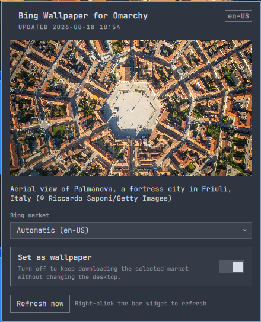

# Bing Wallpaper for Omarchy

A native Omarchy Quattro bar widget and background service that downloads
Bing's current homepage image for one selected market, then optionally sets it
as the system background. It checks immediately when Omarchy Shell starts and
every hour afterward.

The market follows the desktop locale by default. Downloads are atomic,
unchanged images are reused, and the cache retains the eight most recent images
for each market you have selected. Only the currently selected market is
requested and downloaded during a check.



## Requirements

- Omarchy 4 / Quattro
- `curl`, `jq`, `flock`, `sha256sum`, `ffmpeg`, and `ffprobe` (included in a
  standard Omarchy install)
- Network access to `www.bing.com`

The plugin runs without elevated privileges. It contacts Bing's homepage image
feed and stores images under `~/.cache/omarchy/bing-wallpaper/`.

## Bar widget

Enable the plugin to place its native image icon in the right section of the
Omarchy bar. Left-click the image icon to open a panel with:

- A preview and Bing's image attribution
- Market selection, including Bing's Global / Rest-of-World feed
- A **Set as wallpaper** toggle
- A **Refresh now** button and update status

Right-click the bar widget to refresh immediately. With **Set as wallpaper**
off, hourly polling and download of the selected market continue but the
desktop is not changed.

The icon inherits Omarchy's bar foreground color. For a transparent bar,
Omarchy automatically chooses between the theme's text and background colors
after the wallpaper changes. Double-click an empty part of the bar to toggle
transparency globally if a visually busy wallpaper still hurts readability.

## Install

Install directly from GitHub:

```sh
omarchy plugin add https://github.com/odessa2/bing-wallpaper-for-omarchy.git --enable
```

For local development, clone or copy this folder to
`~/.config/omarchy/plugins/io.github.odessa2.bing-wallpaper`, then run:

```sh
omarchy plugin validate ~/.config/omarchy/plugins/io.github.odessa2.bing-wallpaper
omarchy-shell shell rescanPlugins
omarchy plugin enable io.github.odessa2.bing-wallpaper
```

## Update

Update an installed Git-managed plugin through Omarchy so it is validated and
rescanned after the fast-forward:

```sh
omarchy plugin update io.github.odessa2.bing-wallpaper
```

When updating the installed checkout manually during development, force a
rescan after all files have changed. If old and new QML components still appear
mixed, restart the shell:

```sh
omarchy-shell shell rescanPlugins
omarchy restart shell
```

## Configure

Use the native bar panel to select a market and toggle **Set as wallpaper**.
The values are stored with the widget in `~/.config/omarchy/shell.json`:

```json
{
  "id": "io.github.odessa2.bing-wallpaper",
  "market": "de-DE",
  "setWallpaper": false
}
```

- `market`: `auto` uses the desktop locale, `global` selects Bing's
  Rest-of-World feed, or use a market such as `de-DE`, `en-GB`, or `ja-JP`.
- `setWallpaper`: set to `false` to keep polling and downloading the selected
  market without changing the system background. The bar panel exposes this as
  a native toggle.

Omarchy writes this entry atomically and hot-reloads it without rebuilding the
rest of the bar. The settings are also available through Omarchy's native bar
widget settings UI. A valid manual `shell.json` edit is hot-reloaded and causes
the service to refresh automatically.

Inspect the service state with:

```sh
omarchy-shell bing-wallpaper status
```

Image metadata is available in the cache as `current.json`, including Bing's
market, copyright attribution, and link.

### Upgrading from 1.0.0

When no inline settings exist yet, version 1.0.1 reads the previous
`~/.config/omarchy/bing-wallpaper.json` as a fallback. The next change made in
the bar panel stores both values in `shell.json`; the legacy file can then be
removed. The plugin never rewrites `shell.json` merely because it was updated.

## Remove

```sh
omarchy plugin remove io.github.odessa2.bing-wallpaper
```

Omarchy keeps the last selected background after the plugin is removed. If it
points into the plugin cache, select another background before deleting the
downloaded images. Then optionally remove all retained plugin data:

```sh
rm -f ~/.config/omarchy/bing-wallpaper.json
rm -rf ~/.cache/omarchy/bing-wallpaper ~/.local/state/omarchy/bing-wallpaper
```

## Data source

The plugin uses Bing's homepage image archive endpoint:
`https://www.bing.com/HPImageArchive.aspx`. Bing owns the images and associated
metadata; this plugin does not grant redistribution rights.

Images are requested from Bing's `_UHD.jpg` asset, which is the highest-quality
version exposed by the feed. The normal feed URL is used only when a particular
image has no UHD asset.

For safety, the downloader accepts only Bing-relative image paths, does not
follow redirects, limits response sizes, and validates that downloaded bytes
decode as a JPEG before caching or applying them as the wallpaper.
